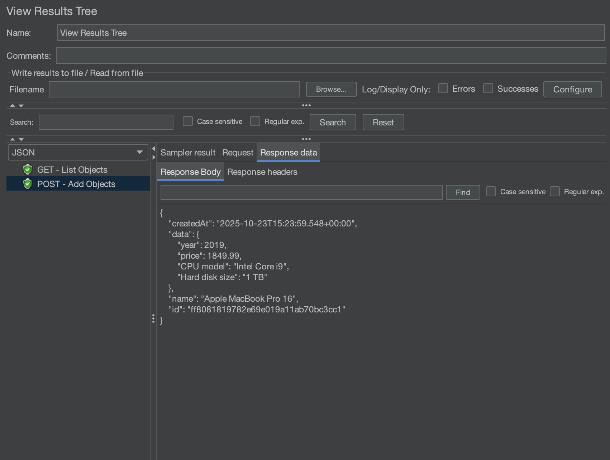
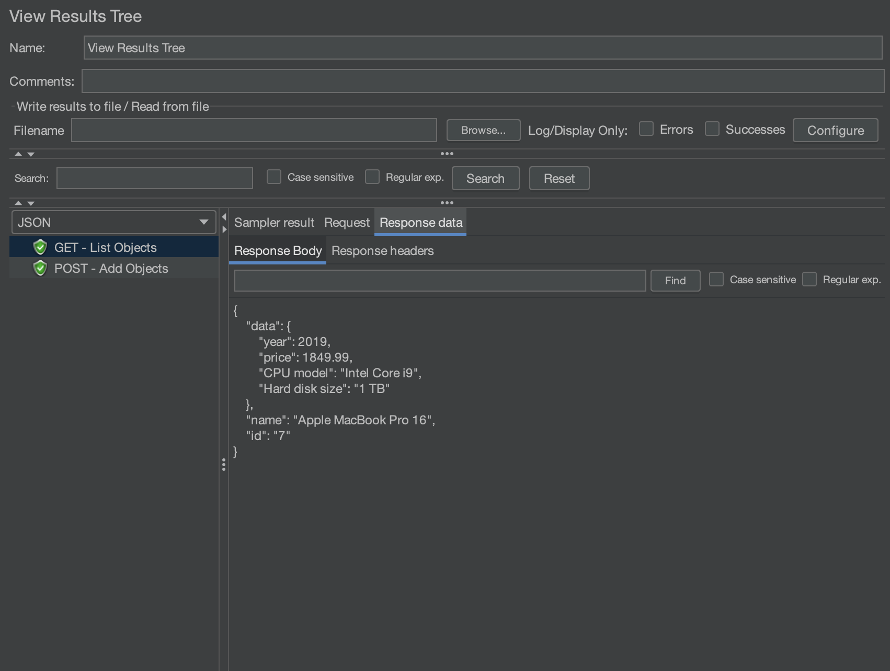
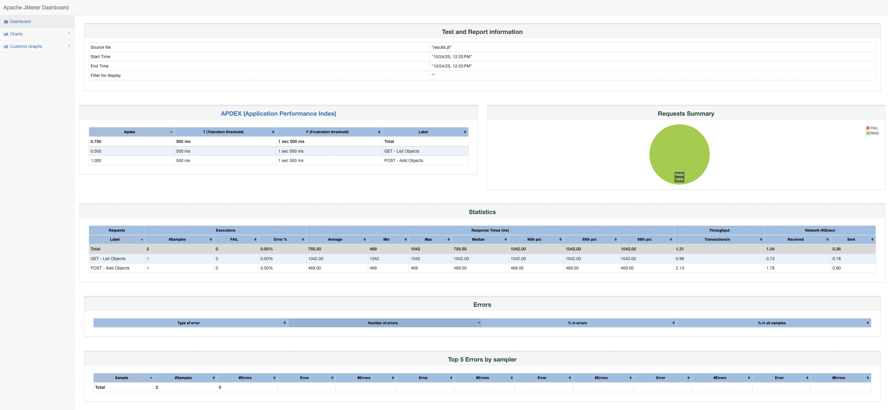

# 🧪 API Testing with Apache JMeter – RESTful API Demo

This project demonstrates manual and automated **API testing using JMeter** against the public endpoint [https://api.restful-api.dev](https://api.restful-api.dev).
Developed as part of the **Digital Skola QA Bootcamp Batch 12** by **Putri Stephanie Lesilolo.**

---

## 📁 Project Structure
```
jmeterRestfulAPI/
├── jmeter_testplan_putristphn.jmx
├── report/
│   ├── html/
│   │   └── index.html
│   └── results.jtl
├── screenshots/
│    ├── post_body.png
│    ├── post_header.png
│    ├── get_body.png
│    ├── get_header.png
│    └── report_dashboard.png
└── README.md
```

--- 
  
## 🚀 Test Scenarios

| Method | Endpoint  | Description |
|--------|-----------|--------------|
| POST   | `/objects`  | Create new object |
| GET    | `/objects/{id}` | Retrieve object by ID |

---

## 🧰 Tools & Setup

| Tool | Description |
|------|--------------|
| **Apache JMeter 5.6.3** | For API load & functional testing |
| **Restful API Demo** | Public REST API endpoint for testing |
| **macOS Terminal** | Used for CLI execution and HTML report generation |
| **GitHub** | For version control & portfolio showcasing |

---

## 📁 Test Structure Overview

```
jmeter_testplan_putristphn.jmx
├── Thread Group
├── GET - List Object
│     ├── GET - Response Assertion
│     ├── GET JSON Assertion - id
│     └── GET JSON Assertion - name
├── POST - Add Object
│     ├── GET - Response Assertion
│     ├── GET JSON Assertion - name
│     └── GET JSON Assertion - data.year
├── HTTP Header Manager
├── View Results Tree
└── Summary Report
```

---

## 📊 Test Flow

### **1️⃣ POST – Add Object**
- **Request URL:** `https://api.restful-api.dev/objects`
- **Purpose:** Creates a new object and validates the API response.
- **Request Body:**
```json
  {
    "name": "Apple MacBook Pro 16",
    "data": {
      "year": 2019,
      "price": 1849.99,
      "CPU model": "Intel Core i9",
      "Hard disk size": "1 TB"
    }
  }
```
- **Validations:**
1. Response status = `200`
2. JSON field `"name"` = `"Apple MacBook Pro 16"`
3. JSON field `"data.year"` = `2019`
4. Extracts the new object id for the next GET step.

### **2️⃣ GET – Retrieve Object**
- **Request URL:** `https://api.restful-api.dev/objects/${createdId}`
- **Purpose:** Retrieves the same object created in the POST test.
- **Validations:**
1. Response status = `200`
2. JSON field `"name"` = `"Apple MacBook Pro 16"`
3. JSON field `"id"` = `2019`

--- 

## 📸 Test Execution Screenshots

### 📨 POST – Add Object
| POST Request Body | POST Response Header    |
|-------------------|-------------------------|
  | 

 🧩 POST request successfully created a new object and returning HTTP 200 OK with valid JSON fields.

### 📨 GET – Retrieve Object
| GET Request Body  | GET Response Header     |
|-------------------|-------------------------|
  | 

 🧠 GET request retrieved the same object, confirming data consistency and successful validation assertions.

### 📊 HTML Dashboard Report

| JMeter HTML Report |


💡 All samplers executed successfully with 0% error rate and a full green status (PASS).

---

## 🧠 Key Learnings

Through this project, I practiced and strengthened:
1. **Assertion Logic:**
Learned how to validate both `Response Code` and nested JSON values using `JSON Assertion`.
2. **Parameterization:**
Extracted dynamic object IDs using `JSON Extractor` to reuse in subsequent GET requests.
3. **Modular Test Plan Design:**
Separated each HTTP method (POST, GET) with dedicated assertions for better maintainability.
4. **HTML Report Generation:**
Used CLI command to generate performance report:
```
jmeter -n -t jmeter_testplan_putristphn.jmx -l report/results.jtl
jmeter -g report/results.jtl -o report/html
```
5. **Error Handling & Debugging:**
Resolved assertion mismatches and learned to interpret HTTP header responses (`HTTP/1.1 200 OK`)

---

## 🚀 How to Run

1. Open `jmeter_testplan_putristphn.jmx` in JMeter GUI.
2. Click **Start ▶️** to execute the test plan.
3. Or run via CLI for report generation:
```
jmeter -n -t jmeter_testplan_putristphn.jmx -l report/results.jtl
jmeter -g report/results.jtl -o report/html
```
4. Open `report/html/index.html` to view the visual dashboard.

---

## 👩🏻‍💻 Author

**Putri Stephanie Lesilolo**  
*Quality Assurance Engineer*  
📍 Jakarta, Indonesia  

🔗 [LinkedIn](https://www.linkedin.com/in/putrilesilolo/) | [GitHub](https://github.com/putristphn)
